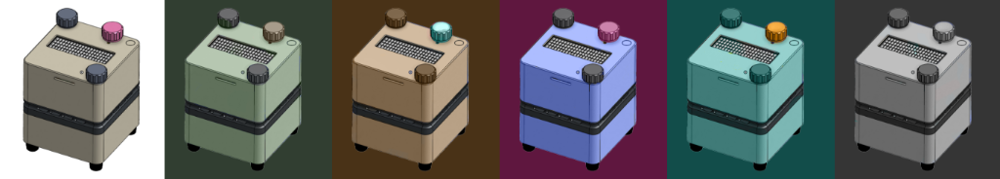
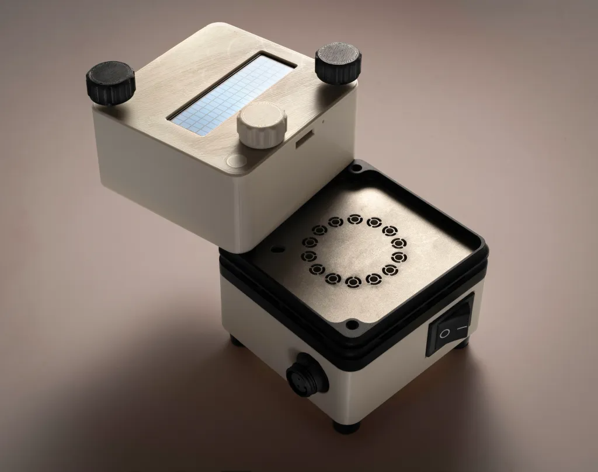

# Daisy Bio

> **Our mission is to develop a low-cost portable PCR platform and an open-source community around it with the hope of opening up access to diagnostics in remote locations.**

---

## 📖 Our Story

PCR instruments, despite existing for decades, remain inaccessible to many poor countries due to high costs. Although production costs can be as low as $400, these devices are sold for $5,000 to $25,000. With the technology now well understood and key patents expired, affordable PCR instruments are achievable.

Led by Thomas Welsh, a veteran of the industry with 35+ years in product development, including eight in PCR instruments, the project launched in 2025, aiming to remove barriers to global diagnostic access.

## 🎯 Our Purpose

Our mission is to **democratize access to advanced DNA analysis** by designing, developing, and distributing low-cost, robust, and open-source DNA analysis instruments.

We aim to:
- Empower researchers, students, and biologists, particularly those working in resource-limited settings.
- Provide complete instruments, DIY kits, and freely available design plans.
- Foster innovation, collaboration, and accessibility in molecular biology.

## 🚀 The Goal

To create an open-source **PCR (polymerase chain reaction) platform** that is:
- **Simple**: Intuitive and user-friendly tools.
- **Affordable**: Enabling diagnostics and treatment where access is limited.
- **Portable**: Hand-held and capable, aimed at a sub-$5,000 price point at scale.

---

[🌐 Visit our website](https://daisybio.com) | [📧 Contact Us](https://daisybio.com/contact/)
